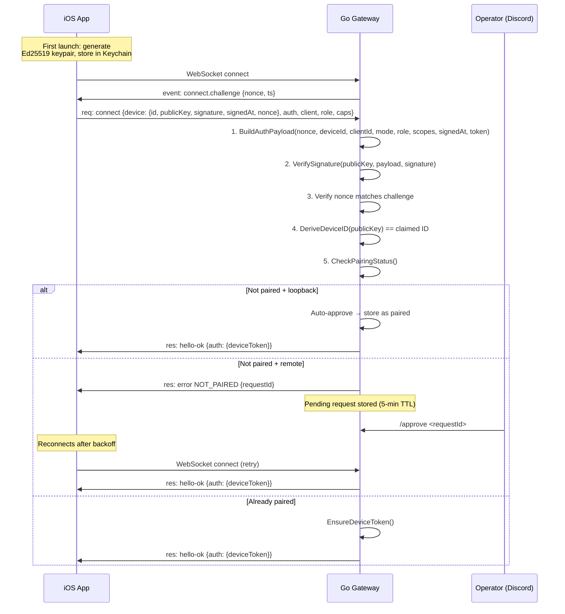

# Device Pairing — Implementation

> Cryptographic device identity + challenge-response pairing for the Go gateway.
> **Scope:** Server-side only. The iOS client will be implemented separately.

**Status: ✅ Implemented** — 72+ tests across `internal/pairing/` and `internal/gateway/`.

---

## Module Map

```
internal/pairing/
  token.go       ← Secure token generation + constant-time verification
  identity.go    ← Ed25519 signature verification, device ID derivation, nonce, payload
  store.go       ← Persistent JSON state (pending, paired, tokens) with atomic writes
  service.go     ← Orchestration: request/approve/reject/verify/revoke, auto-approve

internal/gateway/
  conn.go        ← WithPairing(), verifyDevice() in processConnect()
  server.go      ← PairingSvc config, isLoopback() for auto-approve detection
  gateway.go     ← Wires PairingSvc through to server

internal/discord/
  types.go       ← PairingService / PairingStore interfaces
  router.go      ← /devices, /approve, /reject, /revoke handlers
  bot.go         ← Dispatch for pairing commands

internal/protocol/
  connect.go     ← DeviceConnectPayload, HelloAuthInfo types
```

---

## Pairing Flow



---

## Core Module: `internal/pairing/`

All four files use only Go standard library — no external dependencies.

### token.go

| Function | Description |
|----------|-------------|
| `GeneratePairingToken()` | 32 random bytes → base64url (43 chars), from `crypto/rand` |
| `VerifyPairingToken()` | Constant-time comparison via `crypto/subtle.ConstantTimeCompare` |

### identity.go

| Function | Description |
|----------|-------------|
| `DeriveDeviceID(publicKey)` | SHA-256 of raw 32-byte Ed25519 key → hex string |
| `BuildAuthPayload(params)` | Pipe-delimited: `v2\|deviceId\|clientId\|clientMode\|role\|scopes\|signedAtMs\|token\|nonce` |
| `VerifySignature(pubKey, payload, sig)` | Ed25519 signature verification, all inputs base64url |
| `GenerateNonce()` | UUID v4 for connect challenge |
| `NormalizePublicKey(pubKey)` | Re-encode to canonical base64url (handles padding variants) |

**Signing payload format:** `v2|{deviceId}|{clientId}|{clientMode}|{role}|{scopes}|{signedAtMs}|{token}|{nonce}`

- `scopes` is comma-joined
- `token` is the gateway auth token (may be empty)
- `nonce` is the server-issued challenge

### store.go

Persistent state backed by a JSON file with atomic writes (`write temp → rename`).

| Type | Fields |
|------|--------|
| `PendingRequest` | RequestID, DeviceID, PublicKey, Role, Scopes, CreatedAt, ExpiresAt, DisplayName, Platform |
| `PairedDevice` | DeviceID, PublicKey, Role, Scopes, PairedAt, DisplayName, Platform, Tokens[] |
| `DeviceAuthToken` | Token, Role, Scopes, IssuedAt |

| Method | Description |
|--------|-------------|
| `NewStore(dir)` | Creates state dir (`0700`), loads existing state |
| `AddPending(req)` | Stores pending request with 5-minute TTL |
| `GetPending(requestID)` | Retrieves by request ID |
| `RemovePending(requestID)` | Removes + persists |
| `SetPaired(device)` | Stores paired device |
| `GetPaired(deviceID)` | Retrieves by device ID |
| `ListPending()` / `ListPaired()` | Sorted by timestamp |
| `SetToken(deviceID, token)` | Associates auth token with device |
| `PatchMetadata(deviceID, patch)` | Updates DisplayName/Platform |
| `PruneExpired()` | Removes pending requests past TTL |

**File permissions:** State file written with `0600`. Directory created with `0700`.

### service.go

Orchestration layer wrapping `Store`. Thread-safe (mutex per operation).

| Method | Description |
|--------|-------------|
| `RequestPairing(params)` | Creates pending request, returns request ID |
| `Approve(requestID)` | Moves pending → paired, generates device token |
| `Reject(requestID)` | Removes pending request |
| `CheckPairingStatus(params)` | Returns `"paired"`, `"auto-approved"`, or `"pairing-required"` |
| `VerifyDeviceToken(deviceID, token)` | Constant-time token verification |
| `EnsureDeviceToken(deviceID, role, scopes)` | Returns existing or generates new token |
| `RevokeDeviceToken(deviceID, role)` | Invalidates a device's token |

**Auto-approve logic:** `CheckPairingStatus` with `IsLocal: true` → auto-pairs the device, returns `"auto-approved"`.

---

## Handshake Integration: `internal/gateway/`

### conn.go

The `Conn` struct gains optional pairing fields, set via `WithPairing()`:

```go
func (c *Conn) WithPairing(svc *pairing.Service, remoteAddr string, isLocal bool)
```

**`verifyDevice()` sequence** (called from `processConnect()` when pairing is enabled + client sends `device` payload):

1. **Build signing payload** — `BuildAuthPayload()` with all connect params (nonce, device ID, client ID, mode, role, scopes, auth token, signed-at)
2. **Verify signature** — `VerifySignature()` → `INVALID_SIGNATURE` on failure
3. **Verify nonce** — must match `challengeNonce` sent in `connect.challenge` → `INVALID_NONCE`
4. **Derive device ID** — `DeriveDeviceID()` must match claimed ID → `INVALID_DEVICE_ID`
5. **Check pairing status** — `CheckPairingStatus()` → `paired` / `auto-approved` / `pairing-required`

On success, `DeviceID` and `DeviceToken` are set on the `Conn`. The token is returned to the client in the `hello-ok` response via `HelloAuthInfo`.

**Backward compatibility:** `NewConn()` signature is unchanged. `WithPairing()` is opt-in. Without it, existing token-based auth works identically.

### server.go

```go
type ServerConfig struct {
    Port       int
    Bind       string
    Auth       AuthConfig
    PairingSvc *pairing.Service  // optional — nil disables device pairing
}
```

`handleWS()` extracts `r.RemoteAddr` and calls `isLoopback()` to determine if the connection is local. `isLoopback()` handles:
- IPv4 (`127.0.0.1`)
- IPv6 (`::1`)
- IPv4-mapped IPv6 (`::ffff:127.0.0.1`)
- `localhost`

---

## Discord Commands

Four new slash commands, registered only when pairing is enabled:

| Command | Handler | Description |
|---------|---------|-------------|
| `/devices` | `HandleDevices()` | Lists paired devices and pending requests |
| `/approve <request>` | `HandleApprove()` | Approves a pending request → device becomes paired |
| `/reject <request>` | `HandleReject()` | Rejects and removes a pending request |
| `/revoke <device> [role]` | `HandleRevoke()` | Invalidates a paired device's auth token |

The router uses two interfaces to avoid tight coupling:

```go
type PairingService interface {
    Approve(requestID string) (*PairedDevice, error)
    Reject(requestID string) (*PendingRequest, error)
    RevokeDeviceToken(deviceID, role string) *DeviceAuthToken
}

type PairingStore interface {
    ListPending() []PendingRequest
    ListPaired() []PairedDevice
}
```

---

## Wiring: `main.go`

| Config | Default | Description |
|--------|---------|-------------|
| `--state-dir` | `$XDG_STATE_HOME/goclaw` or `~/.local/state/goclaw` | Persistent state directory |

Startup sequence:

```
parseConfig() → validateConfig() → run()
                                     ├── pairing.NewStore(stateDir/pairing)
                                     ├── pairing.NewService(store)
                                     ├── gateway.New(PairingSvc: svc)
                                     ├── discord: router.WithPairing(svc, store)
                                     └── banner: "pairing: enabled  state: <dir>"
```

---

## Security Model

| Property | Implementation |
|----------|---------------|
| Key type | Ed25519 (32-byte public key, 64-byte signature) |
| Device ID | SHA-256 of raw public key → hex |
| Token generation | 32 bytes from `crypto/rand` → base64url |
| Token comparison | `crypto/subtle.ConstantTimeCompare` |
| Nonce | UUID v4, single-use per challenge |
| Replay prevention | Nonce bound to connection, payload includes `signedAt` |
| File permissions | State file `0600`, state dir `0700` |
| Atomic writes | Write to temp file → `os.Rename` |
| Pending TTL | 5 minutes, pruned automatically |
| Local auto-approve | Loopback connections only (`127.0.0.1`, `::1`) |

---

## Error Codes

| Code | When | Description |
|------|------|-------------|
| `INVALID_SIGNATURE` | Signature check fails | Wrong key, tampered payload, or malformed sig |
| `INVALID_NONCE` | Nonce mismatch | Nonce doesn't match the issued challenge |
| `INVALID_DEVICE_ID` | ID derivation mismatch | Claimed device ID ≠ SHA-256(publicKey) |
| `NOT_PAIRED` | Device not paired + remote | Response includes `{requestId}` for operator approval |
| `PAIRING_ERROR` | Unexpected state | Internal pairing state error |

---

## Test Coverage

| Package | Tests | Coverage |
|---------|-------|----------|
| `internal/pairing/` | 67 | Token, identity, store, service |
| `internal/gateway/` (pairing) | 14 | Loopback auto-approve, invalid sig, nonce mismatch, remote NOT_PAIRED, isLoopback |
| **Total pairing tests** | **81** | |
