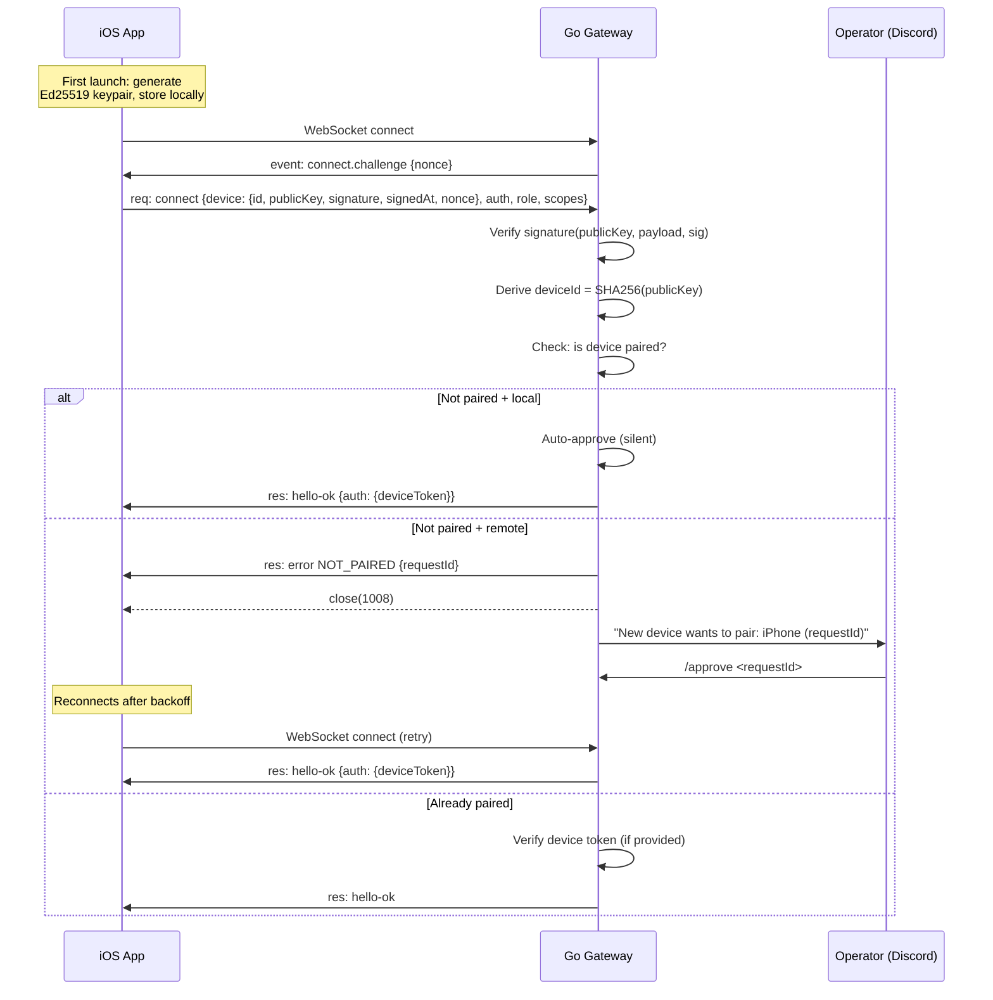

# Device Pairing — Server-Side Implementation Spec

> Cryptographic device identity + challenge-response pairing for the Go gateway.
> **Scope:** Server-side only. The iOS client will be implemented separately.

---

## Overview

Devices (iOS apps) prove identity via **Ed25519 keypairs**. The device ID is the SHA-256 hash of the raw 32-byte public key. Every WebSocket connect includes a signed challenge-response; the server verifies the signature before admitting the connection.

New devices must be **paired** before connecting. Local (loopback) connections are auto-approved. Remote connections create a pending pairing request that an operator approves via Discord.



---

## Architecture

Four files in `goclaw/pairing/`:

| File | Responsibility | Lines (est.) |
|------|---------------|-------------|
| `identity.go` | Ed25519 signature verification, device ID derivation, nonce generation, payload construction | ~120 |
| `store.go` | Persistent JSON state (pending requests, paired devices, tokens) | ~200 |
| `token.go` | Pairing token generation (32-byte base64url), constant-time verification | ~30 |
| `service.go` | Orchestration: request/approve/reject/revoke/verify, auto-approve logic | ~150 |

### Dependency Graph

```
conn (handshake) ──→ service ──→ store ──→ token
                         │
                         └──→ identity
```

The `conn` module (Phase 2) calls `service` during the WebSocket handshake. Discord `handlers` module (Phase 4) calls `service` for `/approve`, `/reject`, `/revoke`, `/devices`.

---

## Module 1: `identity.go` — Cryptographic Identity

### Types

```go
package pairing

// DeviceConnectIdentity is sent by the client in the connect params.
type DeviceConnectIdentity struct {
    ID        string `json:"id"`
    PublicKey string `json:"publicKey"` // base64url-encoded raw 32-byte Ed25519 public key
    Signature string `json:"signature"` // base64url-encoded Ed25519 signature
    SignedAt  int64  `json:"signedAt"`  // milliseconds since epoch
    Nonce     string `json:"nonce"`     // server-issued challenge nonce
}
```

### Functions

```go
// DeriveDeviceID returns SHA-256 hex digest of the raw 32-byte public key.
// The publicKey is base64url-encoded.
// Returns "" if publicKey is invalid.
func DeriveDeviceID(publicKeyBase64Url string) string

// BuildAuthPayload constructs the pipe-delimited signing payload.
// Format: "v2|deviceId|clientId|clientMode|role|scopes|signedAtMs|token|nonce"
// scopes is comma-joined. token defaults to "" if empty.
func BuildAuthPayload(p AuthPayloadParams) string

type AuthPayloadParams struct {
    DeviceID   string
    ClientID   string
    ClientMode string
    Role       string
    Scopes     []string
    SignedAtMs int64
    Token      string // gateway auth token (may be empty)
    Nonce      string // challenge nonce
}

// VerifySignature verifies an Ed25519 signature against a payload.
// publicKey is base64url-encoded raw 32-byte Ed25519 key.
// signature is base64url-encoded.
// Returns false on any error (bad key, bad sig, wrong length).
func VerifySignature(publicKeyBase64Url string, payload string, signatureBase64Url string) bool

// GenerateNonce returns a random UUID string for the connect challenge.
func GenerateNonce() string

// NormalizePublicKey re-encodes a base64url public key to canonical form.
// Returns "" if invalid.
func NormalizePublicKey(publicKeyBase64Url string) string
```

### Constants

```go
const (
    Ed25519PublicKeySize = 32
    SignatureSkewMs      = 60_000 // max clock skew for signedAt (60 seconds)
)
```

### Implementation Notes

- Use `crypto/ed25519` for signature verification — Go's stdlib supports raw 32-byte keys directly
- Base64url decode: use `encoding/base64.RawURLEncoding`
- Device ID: `sha256.Sum256(rawPubKey)` → hex encode
- Payload: `strings.Join(parts, "|")`

---

## Module 2: `token.go` — Pairing Token

### Functions

```go
// GeneratePairingToken returns a 32-byte cryptographically random token
// encoded as base64url (no padding).
func GeneratePairingToken() string

// VerifyPairingToken performs constant-time comparison of two tokens.
// Returns true if they match. Uses crypto/subtle.ConstantTimeCompare.
func VerifyPairingToken(provided, expected string) bool
```

### Implementation Notes

- `crypto/rand.Read(buf)` for 32 bytes → `base64.RawURLEncoding.EncodeToString`
- `subtle.ConstantTimeCompare([]byte(provided), []byte(expected)) == 1`

---

## Module 3: `store.go` — Persistent Pairing State

### Types

```go
// PendingRequest represents a device waiting for operator approval.
type PendingRequest struct {
    RequestID   string   `json:"requestId"`
    DeviceID    string   `json:"deviceId"`
    PublicKey   string   `json:"publicKey"`   // base64url
    DisplayName string   `json:"displayName,omitempty"`
    Platform    string   `json:"platform,omitempty"`
    ClientID    string   `json:"clientId,omitempty"`
    ClientMode  string   `json:"clientMode,omitempty"`
    Role        string   `json:"role,omitempty"`
    Scopes      []string `json:"scopes,omitempty"`
    RemoteIP    string   `json:"remoteIP,omitempty"`
    Silent      bool     `json:"silent,omitempty"`   // true for loopback auto-approve
    IsRepair    bool     `json:"isRepair,omitempty"` // true if re-pairing existing device
    Timestamp   int64    `json:"ts"`                 // Unix ms
}

// DeviceAuthToken is issued per-role after pairing approval.
type DeviceAuthToken struct {
    Token       string   `json:"token"`
    Role        string   `json:"role"`
    Scopes      []string `json:"scopes"`
    CreatedAtMs int64    `json:"createdAtMs"`
    RotatedAtMs int64    `json:"rotatedAtMs,omitempty"`
    RevokedAtMs int64    `json:"revokedAtMs,omitempty"`
    LastUsedMs  int64    `json:"lastUsedAtMs,omitempty"`
}

// PairedDevice represents a fully paired device.
type PairedDevice struct {
    DeviceID    string                    `json:"deviceId"`
    PublicKey   string                    `json:"publicKey"`
    DisplayName string                    `json:"displayName,omitempty"`
    Platform    string                    `json:"platform,omitempty"`
    ClientID    string                    `json:"clientId,omitempty"`
    ClientMode  string                    `json:"clientMode,omitempty"`
    Role        string                    `json:"role,omitempty"`
    Scopes      []string                  `json:"scopes,omitempty"`
    RemoteIP    string                    `json:"remoteIP,omitempty"`
    Tokens      map[string]DeviceAuthToken `json:"tokens,omitempty"` // keyed by role
    CreatedAtMs int64                     `json:"createdAtMs"`
    ApprovedAtMs int64                    `json:"approvedAtMs"`
}

// PairingState is the root state serialized to disk.
type PairingState struct {
    PendingByID     map[string]PendingRequest `json:"pendingById"`
    PairedByDevice  map[string]PairedDevice   `json:"pairedByDeviceId"`
}
```

### Store Interface

```go
// Store manages persistent pairing state.
// All methods are concurrency-safe (internal mutex).
type Store struct {
    mu       sync.Mutex
    state    PairingState
    stateDir string // directory for pending.json and paired.json
}

func NewStore(stateDir string) (*Store, error) // loads from disk or initializes empty

// Read operations
func (s *Store) GetPendingRequest(requestID string) *PendingRequest
func (s *Store) GetPairedDevice(deviceID string) *PairedDevice
func (s *Store) ListPending() []PendingRequest   // sorted by timestamp desc
func (s *Store) ListPaired() []PairedDevice       // sorted by approvedAt desc

// Write operations (all persist to disk)
func (s *Store) AddPending(req PendingRequest) error
func (s *Store) RemovePending(requestID string) *PendingRequest
func (s *Store) SetPaired(device PairedDevice) error
func (s *Store) UpdateDeviceMetadata(deviceID string, patch DeviceMetadataPatch) error
func (s *Store) SetDeviceToken(deviceID, role string, token DeviceAuthToken) error
func (s *Store) PruneExpiredPending(now int64) int // removes entries older than PendingTTL
```

### Constants

```go
const PendingTTLMs = 5 * 60 * 1000 // 5 minutes
```

### Persistence Format

Two JSON files in `stateDir`:
- `pending.json` — `map[requestID]PendingRequest`
- `paired.json` — `map[deviceID]PairedDevice`

Writes use atomic rename (`write to tmp → os.Rename`). Files are chmod `0600`.

---

## Module 4: `service.go` — Pairing Service

### Service Interface

```go
type Service struct {
    store *Store
}

func NewService(store *Store) *Service
```

### Methods

```go
// RequestPairing checks if a device needs pairing and creates a pending request.
// If already paired with matching public key, returns (nil, nil) — no action needed.
// If pending request already exists for this device, returns existing request.
// For new requests, returns the created PendingRequest.
func (s *Service) RequestPairing(req PairingRequestInput) (*PendingRequest, error)

type PairingRequestInput struct {
    DeviceID    string
    PublicKey   string
    DisplayName string
    Platform    string
    ClientID    string
    ClientMode  string
    Role        string
    Scopes      []string
    RemoteIP    string
    IsLocal     bool // true → silent auto-approve
}

// Approve approves a pending pairing request.
// Generates a pairing token for the requested role.
// Moves the device from pending to paired.
// Returns the PairedDevice with token, or nil if requestID not found.
func (s *Service) Approve(requestID string) (*PairedDevice, error)

// Reject removes a pending pairing request without approving.
// Returns the rejected request, or nil if not found.
func (s *Service) Reject(requestID string) (*PendingRequest, error)

// VerifyDeviceToken validates a device token for a given role + scopes.
// Updates lastUsedMs on success. Returns a structured result.
func (s *Service) VerifyDeviceToken(params VerifyTokenParams) VerifyTokenResult

type VerifyTokenParams struct {
    DeviceID string
    Token    string
    Role     string
    Scopes   []string
}

type VerifyTokenResult struct {
    OK     bool
    Reason string // "device-not-paired", "token-missing", "token-revoked",
                  // "token-mismatch", "scope-mismatch"
}

// EnsureDeviceToken returns or creates a token for a paired device + role.
// If an existing non-revoked token with sufficient scopes exists, returns it.
// Otherwise generates a new one (rotating if previous existed).
func (s *Service) EnsureDeviceToken(deviceID, role string, scopes []string) *DeviceAuthToken

// RevokeDeviceToken marks a device's token for a role as revoked.
// Returns the revoked token, or nil if not found.
func (s *Service) RevokeDeviceToken(deviceID, role string) *DeviceAuthToken

// CheckPairingStatus determines what action is needed during handshake.
// Called by the conn module after signature verification succeeds.
func (s *Service) CheckPairingStatus(params CheckPairingParams) PairingAction

type CheckPairingParams struct {
    DeviceID  string
    PublicKey string
    Role      string
    Scopes    []string
    IsLocal   bool
}

type PairingAction struct {
    Status    string // "paired", "pairing-required", "auto-approved"
    RequestID string // set when Status == "pairing-required"
    Device    *PairedDevice
}
```

### Auto-Approve Logic

When `IsLocal == true` (loopback connection):
1. Create pending request with `Silent: true`
2. Immediately approve it
3. Return `Status: "auto-approved"` with the device and token

When `IsLocal == false`:
1. Create pending request with `Silent: false`
2. Return `Status: "pairing-required"` with `RequestID`
3. The conn module closes the WebSocket with error `NOT_PAIRED`
4. The gateway broadcasts `device.pair.requested` to connected operators

---

## Integration Points

### WebSocket Handshake (conn module)

After protocol negotiation and shared-secret auth, the handshake adds these steps:

```
1. On WebSocket open → send connect.challenge event with random nonce
2. Client sends connect request with device identity
3. Server verifies:
   a. DeriveDeviceID(device.publicKey) == device.id
   b. |now - device.signedAt| ≤ 60s (clock skew)
   c. device.nonce == connectNonce
   d. VerifySignature(device.publicKey, BuildAuthPayload(...), device.signature)
4. If signature valid → CheckPairingStatus(...)
5. Based on PairingAction:
   - "paired" → proceed, optionally verify/issue device token
   - "auto-approved" → proceed, issue device token
   - "pairing-required" → respond NOT_PAIRED, close
6. On success → include deviceToken in hello-ok response auth field
```

### Discord Commands (handlers module)

Add these slash commands:

| Command | Action |
|---------|--------|
| `/devices` | List paired + pending devices |
| `/approve <requestId>` | Approve a pending pairing request |
| `/reject <requestId>` | Reject a pending pairing request |
| `/revoke <deviceId>` | Revoke a paired device's token |

---

## TDD Test Tables

### `identity_test.go`

```go
func TestDeriveDeviceID(t *testing.T) {
    tests := []struct {
        name      string
        publicKey string // base64url-encoded 32-byte Ed25519 key
        wantID    string // expected SHA-256 hex
        wantEmpty bool
    }{
        {
            name:      "valid 32-byte key",
            publicKey: /* generate test key */,
            wantID:    /* SHA-256 of raw key */,
        },
        {
            name:      "empty string",
            publicKey: "",
            wantEmpty: true,
        },
        {
            name:      "invalid base64",
            publicKey: "not-valid-base64!!!",
            wantEmpty: true,
        },
        {
            name:      "wrong length (16 bytes)",
            publicKey: /* 16-byte key base64url */,
            wantEmpty: true, // must be exactly 32 bytes
        },
    }
}

func TestBuildAuthPayload(t *testing.T) {
    tests := []struct {
        name   string
        params AuthPayloadParams
        want   string
    }{
        {
            name: "full payload with nonce",
            params: AuthPayloadParams{
                DeviceID: "abc123", ClientID: "openclaw-ios",
                ClientMode: "ui", Role: "node",
                Scopes: []string{"operator.admin", "operator.pairing"},
                SignedAtMs: 1700000000000, Token: "tok_xyz", Nonce: "nonce-uuid",
            },
            want: "v2|abc123|openclaw-ios|ui|node|operator.admin,operator.pairing|1700000000000|tok_xyz|nonce-uuid",
        },
        {
            name: "empty token and scopes",
            params: AuthPayloadParams{
                DeviceID: "abc123", ClientID: "openclaw-ios",
                ClientMode: "ui", Role: "operator",
                Scopes: nil, SignedAtMs: 1700000000000, Nonce: "n",
            },
            want: "v2|abc123|openclaw-ios|ui|operator||1700000000000||n",
        },
    }
}

func TestVerifySignature(t *testing.T) {
    // Generate a test keypair in TestMain or helper
    tests := []struct {
        name      string
        publicKey string // base64url
        payload   string
        signature string // base64url
        want      bool
    }{
        {name: "valid signature", /* sign with test key */, want: true},
        {name: "wrong payload", /* sign "foo", verify "bar" */, want: false},
        {name: "wrong key", /* sign with key A, verify with key B */, want: false},
        {name: "empty signature", publicKey: validKey, payload: "test", signature: "", want: false},
        {name: "corrupt signature", /* flip a byte */, want: false},
        {name: "empty public key", publicKey: "", payload: "test", signature: validSig, want: false},
    }
}

func TestGenerateNonce(t *testing.T) {
    // Verify format (UUID), uniqueness across 100 calls, non-empty
}
```

**Total: 14 tests**

---

### `token_test.go`

```go
func TestGeneratePairingToken(t *testing.T) {
    tests := []struct {
        name string
        check func(t *testing.T, token string)
    }{
        {name: "non-empty", check: func(t *testing.T, token string) { assert(token != "") }},
        {name: "base64url decodable", check: func(t *testing.T, token string) { /* decode, check 32 bytes */ }},
        {name: "unique across calls", check: func(t *testing.T, _ string) { /* generate 100, all different */ }},
    }
}

func TestVerifyPairingToken(t *testing.T) {
    tests := []struct {
        name     string
        provided string
        expected string
        want     bool
    }{
        {name: "matching tokens", provided: "abc", expected: "abc", want: true},
        {name: "mismatched tokens", provided: "abc", expected: "def", want: false},
        {name: "empty provided", provided: "", expected: "abc", want: false},
        {name: "empty expected", provided: "abc", expected: "", want: false},
        {name: "both empty", provided: "", expected: "", want: true},
        {name: "different lengths", provided: "short", expected: "muchlongertoken", want: false},
    }
}
```

**Total: 9 tests**

---

### `store_test.go`

```go
func TestStoreAddAndGetPending(t *testing.T) {
    tests := []struct {
        name    string
        setup   func(s *Store)
        queryID string
        wantNil bool
    }{
        {name: "get existing pending", /* add then get */, wantNil: false},
        {name: "get non-existent", queryID: "missing", wantNil: true},
        {name: "duplicate requestID overwrites", /* add same ID twice */},
    }
}

func TestStoreSetAndGetPaired(t *testing.T) {
    tests := []struct {
        name     string
        deviceID string
        wantNil  bool
    }{
        {name: "get existing paired", wantNil: false},
        {name: "get non-existent", deviceID: "missing", wantNil: true},
    }
}

func TestStoreListPending(t *testing.T) {
    // Add 3 pending requests, verify sorted by timestamp desc
}

func TestStoreListPaired(t *testing.T) {
    // Add 3 paired devices, verify sorted by approvedAt desc
}

func TestStorePruneExpiredPending(t *testing.T) {
    tests := []struct {
        name        string
        pendingAge  int64 // ms ago
        now         int64
        wantPruned  int
        wantRemain  int
    }{
        {name: "prune expired (6 min old)", pendingAge: 6 * 60 * 1000, wantPruned: 1, wantRemain: 0},
        {name: "keep fresh (1 min old)", pendingAge: 1 * 60 * 1000, wantPruned: 0, wantRemain: 1},
        {name: "boundary at 5 min", pendingAge: 5 * 60 * 1000, wantPruned: 0, wantRemain: 1},
        {name: "mixed fresh and expired", /* 2 expired, 1 fresh */, wantPruned: 2, wantRemain: 1},
    }
}

func TestStorePersistence(t *testing.T) {
    // Write state, create new Store from same dir, verify state loaded
}

func TestStoreAtomicWrite(t *testing.T) {
    // Verify file permissions are 0600
    // Verify partial writes don't corrupt (write, crash simulation, reload)
}

func TestStoreRemovePending(t *testing.T) {
    // Add then remove, verify gone; remove non-existent returns nil
}

func TestStoreSetDeviceToken(t *testing.T) {
    // Set token on paired device, verify retrievable; set on non-existent device returns error
}

func TestStoreConcurrency(t *testing.T) {
    // 10 goroutines adding/reading pending simultaneously — no panics
}
```

**Total: 16 tests**

---

### `service_test.go`

```go
func TestRequestPairing(t *testing.T) {
    tests := []struct {
        name          string
        setup         func(s *Store) // pre-populate state
        input         PairingRequestInput
        wantRequestID bool  // true if new pending created
        wantNilResult bool  // true if already paired (no action)
    }{
        {name: "new device creates pending", wantRequestID: true},
        {name: "already paired with same key returns nil", setup: /* pre-pair */, wantNilResult: true},
        {name: "already pending returns existing request", setup: /* pre-pend */, wantRequestID: true},
        {name: "re-pair with different key creates repair request", setup: /* pair then request with new key */},
        {name: "empty deviceID returns error"},
    }
}

func TestApprove(t *testing.T) {
    tests := []struct {
        name         string
        setup        func(s *Store)
        requestID    string
        wantDevice   bool
        wantNil      bool
        wantTokenSet bool
    }{
        {name: "approve pending creates paired device", wantDevice: true, wantTokenSet: true},
        {name: "approve non-existent returns nil", requestID: "missing", wantNil: true},
        {name: "approve removes from pending", wantDevice: true},
        {name: "approve existing device merges metadata"},
    }
}

func TestReject(t *testing.T) {
    tests := []struct{
        name      string
        requestID string
        wantNil   bool
    }{
        {name: "reject existing pending", wantNil: false},
        {name: "reject non-existent returns nil", requestID: "missing", wantNil: true},
    }
}

func TestVerifyDeviceToken(t *testing.T) {
    tests := []struct {
        name   string
        setup  func(s *Store) // create paired device with token
        params VerifyTokenParams
        want   VerifyTokenResult
    }{
        {name: "valid token", want: VerifyTokenResult{OK: true}},
        {name: "device not paired", want: VerifyTokenResult{OK: false, Reason: "device-not-paired"}},
        {name: "token missing for role", want: VerifyTokenResult{OK: false, Reason: "token-missing"}},
        {name: "token revoked", want: VerifyTokenResult{OK: false, Reason: "token-revoked"}},
        {name: "token mismatch", want: VerifyTokenResult{OK: false, Reason: "token-mismatch"}},
        {name: "scope mismatch", want: VerifyTokenResult{OK: false, Reason: "scope-mismatch"}},
        {name: "updates lastUsedMs on success"},
    }
}

func TestEnsureDeviceToken(t *testing.T) {
    tests := []struct {
        name       string
        setup      func(s *Store)
        deviceID   string
        role       string
        scopes     []string
        wantNil    bool
        wantRotate bool // true if existing token should be rotated
    }{
        {name: "create new token for paired device", wantNil: false},
        {name: "return existing valid token", wantRotate: false},
        {name: "rotate when scopes expanded", wantRotate: true},
        {name: "rotate when token is revoked", wantRotate: true},
        {name: "nil for unpaired device", wantNil: true},
    }
}

func TestRevokeDeviceToken(t *testing.T) {
    tests := []struct {
        name     string
        deviceID string
        role     string
        wantNil  bool
    }{
        {name: "revoke existing token", wantNil: false},
        {name: "revoke non-existent device", deviceID: "missing", wantNil: true},
        {name: "revoke non-existent role", role: "missing", wantNil: true},
    }
}

func TestCheckPairingStatus(t *testing.T) {
    tests := []struct {
        name   string
        setup  func(s *Store)
        params CheckPairingParams
        want   string // expected Status
    }{
        {name: "paired device returns paired", want: "paired"},
        {name: "unpaired local auto-approves", want: "auto-approved"},
        {name: "unpaired remote requires pairing", want: "pairing-required"},
        {name: "paired with wrong key requires re-pair", want: "pairing-required"},
        {name: "paired device requesting new role requires re-pair", want: "pairing-required"},
        {name: "paired device requesting new scope requires re-pair", want: "pairing-required"},
    }
}
```

**Total: 28 tests**

---

## Test Summary

| File | Tests |
|------|-------|
| `identity_test.go` | 14 |
| `token_test.go` | 9 |
| `store_test.go` | 16 |
| `service_test.go` | 28 |
| **Total** | **67** |

---

## File Layout

```
goclaw/
├── pairing/
│   ├── identity.go          # Ed25519 verification, device ID, nonce, payload
│   ├── identity_test.go
│   ├── token.go             # Token generation + constant-time verify
│   ├── token_test.go
│   ├── store.go             # Persistent JSON state with mutex
│   ├── store_test.go
│   ├── service.go           # Orchestration (request/approve/reject/revoke/verify)
│   └── service_test.go
```

---

## Implementation Order (TDD)

1. **`token.go`** — smallest, no dependencies. Write tests → implement.
2. **`identity.go`** — crypto primitives. Generate a test keypair in `TestMain`. Write tests → implement.
3. **`store.go`** — persistence layer. Use `t.TempDir()` for state. Write tests → implement.
4. **`service.go`** — orchestration. Mock nothing — use real `Store` with temp dirs. Write tests → implement.

> [!IMPORTANT]
> After implementing these 4 files, the `conn` module (Phase 2) handshake needs to call `service.CheckPairingStatus()` and `service.VerifyDeviceToken()`, and the Discord `handlers` module (Phase 4) needs `/approve`, `/reject`, `/revoke`, `/devices` commands. Those integration points should be added when implementing those phases.

---

## Dependencies

- **Standard library only**: `crypto/ed25519`, `crypto/sha256`, `crypto/rand`, `crypto/subtle`, `encoding/base64`, `encoding/json`, `os`, `sync`
- **No external dependencies** required for the pairing module itself

---

## Security Checklist

- [ ] Constant-time token comparison (`crypto/subtle`)
- [ ] Ed25519 signature verification (not ECDSA — Ed25519 is deterministic, no nonce reuse risk)
- [ ] State files chmod `0600`
- [ ] Atomic writes (tmp → rename) to prevent corruption
- [ ] Pending requests expire after 5 minutes
- [ ] Clock skew check on `signedAt` (reject if >60s drift)
- [ ] Challenge nonce prevents replay of intercepted connect messages
- [ ] Device ID derived from public key (can't be spoofed separately)
