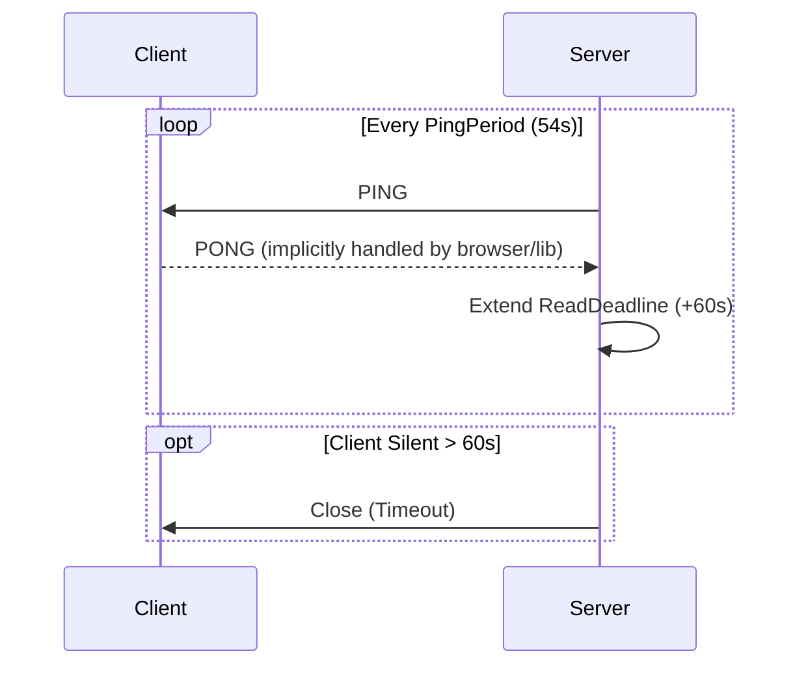

# Pragmatic System Improvements — Implementation

> Reliability, Observability, and Security enhancements for the Go gateway.
> **Scope:** Server-side implementation of essential production features.

**Status: ✅ Implemented** — Verified via TDD in `internal/gateway/`.

---

## Module Map

```
internal/gateway/
  conn.go           ← Added ReadLimit, SetReadDeadline, PingLoop, PongHandler
  server.go         ← Added /metrics handler, RateLimiter middleware, ServerConfig fields
  metrics.go        ← Prometheus registry, metric definitions (clients, messages, errors)
  safety_test.go    ← Tests: Max message size, Heartbeat timeouts
  rate_limit_test.go← Tests: Token bucket rate limiting (req/sec burst)

cmd/goclaw/
  main.go           ← Configured slog (JSON logging), updated signal handling
```

---

## 1. Observability (Metrics & Logs)

### Metrics (`internal/gateway/metrics.go`)
Implemented using `prometheus/client_golang`. Exposed at `GET /metrics`.

| Metric Name | Type | Labels | Description |
|-------------|------|--------|-------------|
| `goclaw_connected_clients` | Gauge | - | Current number of active WebSocket connections |
| `goclaw_messages_total` | Counter | `direction` (in/out), `type` | Total messages processed |
| `goclaw_errors_total` | Counter | `type` (auth, protocol, rate_limit) | Total errors encountered |

### Structured Logging (`slog`)
Implemented `MultiHandler` for dual output.

- **Console**: Pretty-printed text logs (Debug/Info) for development.
- **File**: JSON logs (Info) for production/aggregation.
    - **Path**: `<state-dir>/logs/goclaw.log`
    - **Rotation**: Handled by `lumberjack.v2`.
        - Max Size: 10MB
        - Max Backups: 3
        - Max Age: 28 days
        - Compression: Enabled

```go
// internal/logger/logger.go
func Setup(stateDir string) {
    fileLogger := &lumberjack.Logger{...}
    jsonHandler := slog.NewJSONHandler(fileLogger, ...)
    consoleHandler := slog.NewTextHandler(os.Stdout, ...)
    slog.SetDefault(slog.New(NewMultiHandler(jsonHandler, consoleHandler)))
}
```

---

## 2. Reliability (WebSocket Safety)

### Resource Limits
Prevent OOMs and slowloris attacks.

- **Read Limit**: 512KB (Hard cap).
    - `ws.SetReadLimit(512 * 1024)`
    - Payloads > 512KB trigger `CloseMessageTooBig`.
- **Read Deadlines**:
    - `PongWait`: 60s (default).
    - `PingPeriod`: 54s (90% of PongWait).
    - If client doesn't send data (or Pong) within `PongWait`, connection is forcibly closed.

### Heartbeat Protocol
Server automatically manages Pings. Client **MUST** respond to Pings (standard WebSocket behavior).



---

## 3. Security (Rate Limiting)

### IP-based Token Bucket
Implemented using `golang.org/x/time/rate`.
- **Strategy**: Per-IP limiter map.
- **Cleanup**: (Future optimization) Map clean up not currently implemented for long-running process (RAM risk for millions of unique IPs, manageable for typical gateway load).
- **Default Limits**:
    - Rate: 5 requests/second
    - Burst: 10 requests

```go
// internal/gateway/server.go
limiter := rate.NewLimiter(rate.Limit(5.0), 10)
if !limiter.Allow() {
    http.Error(w, "Too Many Requests", 429)
    return
}
```

---

## 4. Deployment

### Dockerfile
Multi-stage build pattern for minimal, secure images.

1.  **Builder**: `golang:1.21-alpine`
    - Compiles static binary (`CGO_ENABLED=0`).
    - Strips debug info (`-ldflags="-w -s"`) for size.
2.  **Runtime**: `gcr.io/distroless/static-debian12`
    - Non-root user (`nonroot:nonroot`).
    - No shell, no package manager (Attack surface reduction).

### Systemd Unit (`goclaw.service`)
Standard production unit file.
- **Restart**: `always` (5s logic).
- **Security**:
    - `NoNewPrivileges=true`
    - `ProtectSystem=full`
    - `ProtectHome=true`
    - `PrivateTmp=true`
